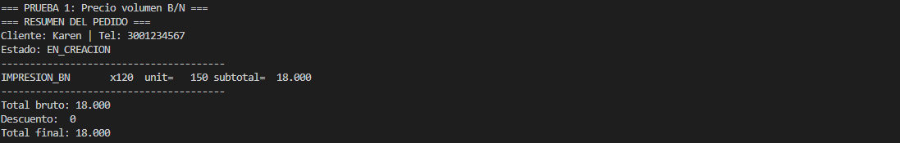
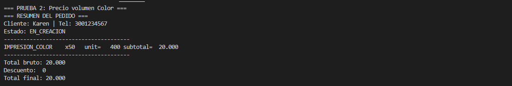
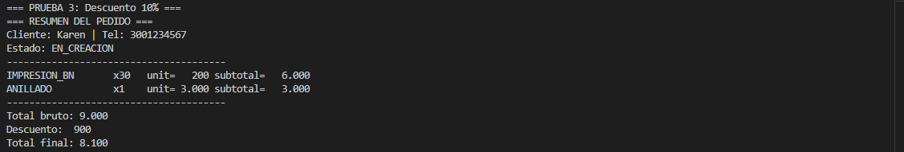
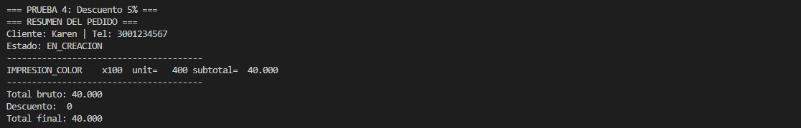
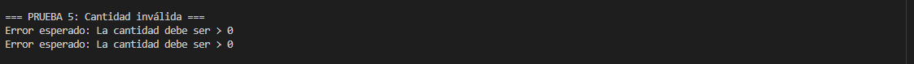
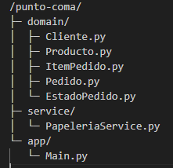

# Papelería “Punto & Coma”

En Punto & Coma, estudiantes e independientes hacen encargos de impresión y anillado para recoger el mismo día. El sistema registra nombre y teléfono del cliente y permite crear un pedido con ítems de este catálogo: Impresión B/N ($200 c/u, o $150 c/u si son 100 o más), Impresión Color ($500 c/u, o $400 c/u si son 50 o más), y Anillado ($3.000 c/u, sin precio por volumen). El cálculo funciona así: primero determinar subtotales por ítem aplicando precio por volumen cuando corresponda; luego sumar el total bruto; después aplicar un solo beneficio: 
-si el pedido incluye al menos un anillado y la suma de impresiones (B/N + Color) es ≥ 30, se aplica 10% de descuento; de lo contrario, si el total bruto > $40.000, aplicar 5% de descuento; si ninguna condición se cumple, no hay descuento. No se aceptan cantidades ≤ 0. Tras confirmar el pedido, queda bloqueado y el sistema debe mostrar un resumen con detalle (precio aplicado por ítem), total bruto, descuento y total final. 
No se gestiona inventario ni pagos: solo el flujo de crear → calcular → confirmar → resumir.

analisis del ejercicio
1- Requerimientos funcionales 

RF1. Registrar cliente (nombre, teléfono).
RF2. Crear pedido en estado EN_CREACION.
RF3. Agregar items al pedido.
RF4 Calcular total bruto.
RF5. Aplicar descuentos
RF6. Confirmar pedido.  cambia a estado CONFIRMADO y ya no puede editarse.
RF8. Validar que las cantidades sean mayores a 0.
RF8. Mostrar resumen :Cliente (nombre y teléfono);Ítems con precios aplicados;Subtotal por ítem;Total bruto;Descuento aplicado;Total final

2-Reglas del Negocio

Impresión B/N = Precio Normal $200 -  Precio Volumen	$150	Desde 100 unidades
Impresión Color = Precio Normal $500 -  Precio Volumen $400	Desde 50 unidades
Anillado	$3.000	—	No aplica 

Descuentos:
10% si el pedido tiene >= 1 anillado y el total de impresiones (B/N + Color) >= 30.
5% si el total bruto > $40.000 (solo si no aplica el 10%).
Sin descuento si no se cumple ninguno.

Estados del pedido:

EN_CREACION → puede agregar ítems.
CONFIRMADO → no editable.

Validaciones:
Cantidades > 0
Totales no negativos
Pedido confirmado no se puede modificar

Restricciones:
No hay inventario, pagos ni base de datos.
Consola o línea de comandos simple.

CA1. Precio por volumen (Impresión B/N)

Dado que agrego un ítem de impresión blanco y negro con cantidad de 100 unidades,
Cuando el sistema calcula el subtotal,
Entonces debe aplicar el precio unitario por volumen de $150 (y no $200).

 

CA2. Precio por volumen (Impresión Color)

Dado que agrego un ítem de impresión color con cantidad de 50 unidades,
Cuando el sistema calcula el subtotal,
Entonces debe aplicar el precio unitario por volumen de $400 (y no $500).

 

CA3. Descuento del 10% (Anillado + impresiones ≥ 30)

Dado un pedido que incluye al menos un anillado y un total de 30 o más impresiones,
Cuando el sistema calcula el total final,
Entonces debe aplicar un 10% de descuento sobre el total bruto.

 

CA4. Descuento del 5% (total bruto > 40.000 sin cumplir 10%)

Dado un pedido sin anillado y con un total bruto superior a $40.000,
Cuando el sistema calcula el total final,
Entonces debe aplicar un 5% de descuento.

 

CA5. Validación de cantidad

Dado que se intenta agregar un ítem con cantidad igual o menor a 0,
Cuando se procesa la operación,
Entonces el sistema debe rechazarla e impedir agregar el ítem.

 

CA6. Bloqueo de edición tras confirmación

Dado un pedido que ya está en estado CONFIRMADO,
Cuando se intenta agregar o modificar cualquier ítem,
Entonces el sistema debe rechazar la acción.

 Diseño 

 
1-Cliente
Atributos: nombre, telefono.

2-Producto (enum)
Define los tres productos del catálogo con precios normales y por volumen.

3-ItemPedido
Atributos: producto, cantidad.
Método: subtotal() → determina precio aplicado (normal o por volumen).

4-Pedido
Atributos: cliente, items, estado.
Métodos:
agregar_item() (valida estado y cantidad > 0)
calcular_total_bruto()
calcular_descuento() (aplica 10% o 5%)
calcular_total_final()
confirmar()
resumen()

5-PapeleriaService
Coordina los casos de uso: crear pedido, agregar ítems, confirmar, mostrar resumen.

-----------------------------
5-Flujo de Consola
Ingresar datos del cliente (nombre y teléfono).
Crear pedido nuevo (estado EN_CREACION).
Agregar ítems seleccionando producto y cantidad.
Mostrar detalle del pedido con precios aplicados (normal o volumen) y total bruto.
Calcular descuento aplicable (10%, 5% o ninguno).
Mostrar resumen completo: subtotal, descuento, total final.
Confirmar pedido → cambia a CONFIRMADO.

Estructura del proyecto.

 

